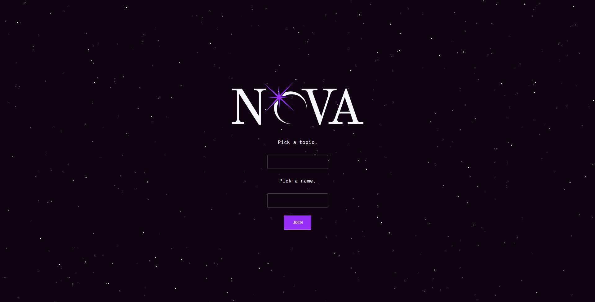

# Nova Chat



A pubsub chat demo using websockets and [Nova](https://github.com/novaframework/nova). 

This implementation uses [nova_pubsub](https://github.com/novaframework/nova_pubsub) to store all state in [ets](https://www.erlang.org/doc/man/ets.html). Should the server restart, all current topics are therefore closed and users will need to reconnect.

## How it works

The client `POST`s to:

```javascript
await fetch(`http://localhost:8080/user/${user}/subscribe`,
    { method: 'POST', body: `{"topic":"${topic}"}` }
)
```

Informing the backend that `user` wants to subscribe to `topic`.

```erlang
%% src/controllers/nova_chat_main_controller.erl

subscribe(#{method := <<"POST">>,
            bindings := #{<<"user">> := User}} = Req) ->
    {ok, Data, _} = cowboy_req:read_body(Req),
    #{<<"topic">> := Topic} = json:decode(Data, [maps]),
    nova_pubsub:subscribe(User, Topic),
    {json, <<"Subscribed!">>};
```

client now connects to the backend:

```javascript
socket = new WebSocket(`ws://localhost:8080/user/${user}/ws`)
```

```erlang
%% src/nova_chat_ws.erl

websocket_init(State) ->
    #{<<"user">> := User} = State,
    ok = nova_pubsub:online(User, self()),
    {ok, State}.
```

This sets `user` as online on that socket.

When a user wants to write a message, client pushes data
on the socket that gets pickuped up by the backend:

```javascript
socket.send(JSON.stringify(
    { 'topic': 'erlang', 'payload': 'Hello Joe!' }))
```

```erlang
%% src/nova_chat_ws.erl

websocket_handle({text, Message}, State) ->
    Decode = json:decode(Message, [maps]),
    #{<<"user">> := User} = State,
    #{<<"topic">> := Topic} = Decode,
    Json = json:encode(Decode#{<<"user">> => User}, 
                       [maps, binary]),
    ok = nova_pubsub:publish(Topic, Json),
    {ok, State}.
```

Nova looks up all the users that are subscribed to `topic`, and if they are online pushes this message to client:

```javascript
{
    "topic": "erlang",
    "user": "nova",
    "payload":"Hello Joe!"
}
```